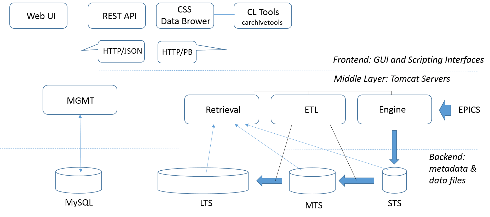

============================
Archiver Appliance Overview
============================

The  EPICS  `Archiver Appliance 
<https://slacmshankar.github.io/epicsarchiver_docs>`_ 
is developed by Murali Shankar, SLAC. As shown in the Figure, 
its architecture is designed after the standard three-tier approach.

The data in the bottom data layer are collected in three data stores: 

- STS: short-term temporary file storage (tmpfs) implemented with 
  the RAM disk used as an one-hour buffer

- MTS: middle-term repository of the Protocol Buffer daily files 
  accumulated over one week (e.g. /DATA/mts)

- LTS: long-term repository of the Protocol Buffer annual files
  (e.g., /DATA/lts)

In addition to data files, the bottom layer includes the MySQL 
archappl database for maintaining the PV meta data that encompasses
the PV fields (e.g., alarm limits) and archiver parameters (e.g., 
sampling period). 

The Archiver Appliance middle layer consists of four Tomcat-based 
Java servers: 

- Engine: establishes Channel Access monitors and then writers 
  the data into the short term storage (STS)

- ETL (Extract, Transform, and Load): moves data from the STS to 
  the MTS and from the MTS to the LTS

- Retrieval: gathers data from all the stores, and then stitches 
  them together to satisfy the data retrieval requests

- MGMT: manages all the other three servers and holds the configuration 
  state

The  top layer encompasses GUI, Web, and scripting interfaces that 
communicate with the middle  layer servers. Specifically, plots  with  
time series are provided by the Data Browser module from the Control 
System Studio (CSS). Both the CSS and Python applications use the
composite communication approach based on the HTTP protocol and binary 
Protocol  Buffer  messages. For the  administration and  configuration 
of the EPICS Archiver Appliance, the MGMT server exposes a set of Web 
service calls (business process logic) that can be accessed via Web UI
or Python interface using the REST (Representational State Transfer) API. 

